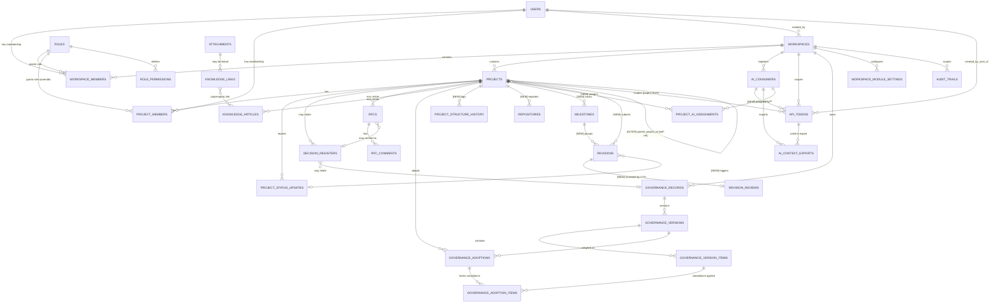

# PMOIS v2 — MySQL ER Diagram & Database Table Design (M0 Item 2)

**Revision:** 1 (corrects M0 draft — grounded in actual existing PMOIS schema, migrations `0001`–`0032`)

## 0. How to Read This Document

Every table below is tagged:

| Tag | Meaning |
|-----|---------|
| **[EXISTING]** | Table already exists in production migrations (`database/migrations/0001`–`0032`). Copied here exactly as implemented. Do not redesign. |
| **[ALTER]** | Existing table needs additional column(s) to satisfy M0 requirements. Existing columns are unchanged. |
| **[NEW]** | Table does not exist yet. Required to satisfy an explicit M0 requirement (hierarchy, milestones, repositories, revisions, AI assignment). Proposal, pending CTO approval before migration is written. |

All `[NEW]`/`[ALTER]` tables follow the existing conventions already used across the codebase:
- `BIGINT UNSIGNED AUTO_INCREMENT PRIMARY KEY` for internal IDs
- `workspace_id` present on every workspace-scoped table (per `BaseRepository` workspace-scoping pattern)
- `created_at` / `updated_at` as `TIMESTAMP ... ON UPDATE CURRENT_TIMESTAMP`
- `ENGINE=InnoDB DEFAULT CHARSET=utf8mb4`
- No new ORM — raw PDO, following `src/Infrastructure/Persistence/MySQL/BaseRepository.php`

---

## 1. Full ER Diagram (Mermaid)



**Note on scope:** `TASKS` and `RISK_ISSUE` tables are referenced by existing `role_permissions` seed data (`task.*`, `risk_issue.*` permission codes) but their tables were never created in migrations 0001–0032. They are **out of M0 scope** — flagged as a pre-existing gap, not something this revision invents or resolves. See Section 6.

---

## 2. Existing Tables (Verbatim from Migrations — `[EXISTING]`)

### 2.1 `users` [EXISTING, see also 2.1a ALTER]

```sql
CREATE TABLE users (
    id BIGINT UNSIGNED AUTO_INCREMENT PRIMARY KEY,
    name VARCHAR(150) NOT NULL,
    email VARCHAR(150) NOT NULL,
    password_hash VARCHAR(255) NOT NULL,
    status ENUM('active','suspended') NOT NULL DEFAULT 'active',
    is_platform_admin BOOLEAN NOT NULL DEFAULT FALSE,
    created_at TIMESTAMP NOT NULL DEFAULT CURRENT_TIMESTAMP,
    updated_at TIMESTAMP NOT NULL DEFAULT CURRENT_TIMESTAMP ON UPDATE CURRENT_TIMESTAMP,
    UNIQUE KEY uq_users_email (email)
) ENGINE=InnoDB DEFAULT CHARSET=utf8mb4;
```
Source: `0001_create_users.sql`

### 2.2 `workspaces` [EXISTING]

```sql
CREATE TABLE workspaces (
    id BIGINT UNSIGNED AUTO_INCREMENT PRIMARY KEY,
    code VARCHAR(50) NOT NULL,
    name VARCHAR(150) NOT NULL,
    description TEXT NULL,
    status ENUM('active','inactive') NOT NULL DEFAULT 'active',
    created_by BIGINT UNSIGNED NOT NULL,
    created_at TIMESTAMP NOT NULL DEFAULT CURRENT_TIMESTAMP,
    updated_at TIMESTAMP NOT NULL DEFAULT CURRENT_TIMESTAMP ON UPDATE CURRENT_TIMESTAMP,
    UNIQUE KEY uq_workspaces_code (code),
    CONSTRAINT fk_workspaces_created_by FOREIGN KEY (created_by) REFERENCES users(id)
) ENGINE=InnoDB DEFAULT CHARSET=utf8mb4;
```
Source: `0002_create_workspaces.sql`

### 2.3 `roles` [EXISTING] + real seed data

```sql
CREATE TABLE roles (
    id BIGINT UNSIGNED AUTO_INCREMENT PRIMARY KEY,
    code VARCHAR(50) NOT NULL,
    name VARCHAR(100) NOT NULL,
    description TEXT NULL,
    created_at TIMESTAMP NOT NULL DEFAULT CURRENT_TIMESTAMP,
    updated_at TIMESTAMP NOT NULL DEFAULT CURRENT_TIMESTAMP ON UPDATE CURRENT_TIMESTAMP,
    UNIQUE KEY uq_roles_code (code)
) ENGINE=InnoDB DEFAULT CHARSET=utf8mb4;
```
Source: `0003_create_roles.sql`. Seeded roles (`0011_seed_default_roles.sql`): `ADMIN`, `MEMBER`, `VIEWER`, `CTO`, `SENIOR_DEV`, `PMO_REVIEWER`.

> **Important correction from M0 draft:** the earlier draft assumed roles named `CEO / CTO / Dev / Viewer`. The real system has no `CEO` role row — the CEO/PMO Portfolio Owner authority is expressed via `users.is_platform_admin = 1` (a user attribute, not a role), combined with the `PMO_REVIEWER` role for approval actions. `Dev` maps to `MEMBER` (general) or `SENIOR_DEV` (technical, no review rights). See `12-Role-Permission-Matrix.md` (revised) for the full mapping.

### 2.4 `role_permissions` [EXISTING]

```sql
CREATE TABLE role_permissions (
    id BIGINT UNSIGNED AUTO_INCREMENT PRIMARY KEY,
    role_id BIGINT UNSIGNED NOT NULL,
    permission_code VARCHAR(100) NOT NULL,
    created_at TIMESTAMP NOT NULL DEFAULT CURRENT_TIMESTAMP,
    UNIQUE KEY uq_role_permission (role_id, permission_code),
    CONSTRAINT fk_role_permissions_role FOREIGN KEY (role_id) REFERENCES roles(id) ON DELETE CASCADE
) ENGINE=InnoDB DEFAULT CHARSET=utf8mb4;
```
Source: `0004_create_role_permissions.sql`. `permission_code` is free-text VARCHAR by design (no FK to a permission master table); the authoritative list lives in `0012_seed_role_permissions.sql` (e.g. `project.create`, `milestone.update`, `rfc.review`, `governance_adoption.create`, `api_token.create`).

### 2.5 `workspace_members` [EXISTING]

```sql
CREATE TABLE workspace_members (
    id BIGINT UNSIGNED AUTO_INCREMENT PRIMARY KEY,
    workspace_id BIGINT UNSIGNED NOT NULL,
    user_id BIGINT UNSIGNED NOT NULL,
    role_id BIGINT UNSIGNED NOT NULL,
    status ENUM('active','removed') NOT NULL DEFAULT 'active',
    joined_at TIMESTAMP NOT NULL DEFAULT CURRENT_TIMESTAMP,
    created_at TIMESTAMP NOT NULL DEFAULT CURRENT_TIMESTAMP,
    updated_at TIMESTAMP NOT NULL DEFAULT CURRENT_TIMESTAMP ON UPDATE CURRENT_TIMESTAMP,
    UNIQUE KEY uq_workspace_user (workspace_id, user_id),
    CONSTRAINT fk_wm_workspace FOREIGN KEY (workspace_id) REFERENCES workspaces(id),
    CONSTRAINT fk_wm_user FOREIGN KEY (user_id) REFERENCES users(id),
    CONSTRAINT fk_wm_role FOREIGN KEY (role_id) REFERENCES roles(id)
) ENGINE=InnoDB DEFAULT CHARSET=utf8mb4;
```
Source: `0005_create_workspace_members.sql`

### 2.6 `projects` [EXISTING, see also 2.6a ALTER]

```sql
CREATE TABLE projects (
    id BIGINT UNSIGNED AUTO_INCREMENT PRIMARY KEY,
    workspace_id BIGINT UNSIGNED NOT NULL,
    code VARCHAR(50) NOT NULL,
    name VARCHAR(150) NOT NULL,
    description TEXT NULL,
    status ENUM('planning','active','on_hold','closed') NOT NULL DEFAULT 'planning',
    start_date DATE NULL,
    end_date DATE NULL,
    owner_user_id BIGINT UNSIGNED NOT NULL,
    created_at TIMESTAMP NOT NULL DEFAULT CURRENT_TIMESTAMP,
    updated_at TIMESTAMP NOT NULL DEFAULT CURRENT_TIMESTAMP ON UPDATE CURRENT_TIMESTAMP,
    UNIQUE KEY uq_workspace_project_code (workspace_id, code),
    CONSTRAINT fk_projects_workspace FOREIGN KEY (workspace_id) REFERENCES workspaces(id),
    CONSTRAINT fk_projects_owner FOREIGN KEY (owner_user_id) REFERENCES users(id)
) ENGINE=InnoDB DEFAULT CHARSET=utf8mb4;
```
Source: `0006_create_projects.sql`. **`id` (BIGINT AUTO_INCREMENT) is the Internal/Immutable Project ID** — see Section 4.

### 2.7 `project_members` [EXISTING]

```sql
CREATE TABLE project_members (
    id BIGINT UNSIGNED AUTO_INCREMENT PRIMARY KEY,
    project_id BIGINT UNSIGNED NOT NULL,
    user_id BIGINT UNSIGNED NOT NULL,
    role_id BIGINT UNSIGNED NOT NULL,
    created_at TIMESTAMP NOT NULL DEFAULT CURRENT_TIMESTAMP,
    updated_at TIMESTAMP NOT NULL DEFAULT CURRENT_TIMESTAMP ON UPDATE CURRENT_TIMESTAMP,
    UNIQUE KEY uq_project_user (project_id, user_id),
    CONSTRAINT fk_pm_project FOREIGN KEY (project_id) REFERENCES projects(id),
    CONSTRAINT fk_pm_user FOREIGN KEY (user_id) REFERENCES users(id),
    CONSTRAINT fk_pm_role FOREIGN KEY (role_id) REFERENCES roles(id)
) ENGINE=InnoDB DEFAULT CHARSET=utf8mb4;
```
Source: `0007_create_project_members.sql`. This is the authorization override table read by `PermissionResolver::can()` **before** falling back to `workspace_members`.

### 2.8 `workspace_module_settings` [EXISTING]

```sql
CREATE TABLE workspace_module_settings (
    id BIGINT UNSIGNED AUTO_INCREMENT PRIMARY KEY,
    workspace_id BIGINT UNSIGNED NOT NULL,
    module_code ENUM('task_management','milestone_tracking','risk_issue_tracking') NOT NULL,
    is_enabled BOOLEAN NOT NULL DEFAULT FALSE,
    enabled_by BIGINT UNSIGNED NULL,
    enabled_at TIMESTAMP NULL,
    created_at TIMESTAMP NOT NULL DEFAULT CURRENT_TIMESTAMP,
    updated_at TIMESTAMP NOT NULL DEFAULT CURRENT_TIMESTAMP ON UPDATE CURRENT_TIMESTAMP,
    UNIQUE KEY uq_workspace_module (workspace_id, module_code),
    CONSTRAINT fk_wms_workspace FOREIGN KEY (workspace_id) REFERENCES workspaces(id),
    CONSTRAINT fk_wms_enabled_by FOREIGN KEY (enabled_by) REFERENCES users(id)
) ENGINE=InnoDB DEFAULT CHARSET=utf8mb4;
```
Source: `0008_create_workspace_module_settings.sql`. `milestone_tracking` module code already exists here — the M0 `MILESTONES` table (Section 3) is the concrete implementation this switch was reserved for.

### 2.9 `api_tokens` [EXISTING, cumulative through 0009/0026/0031]

```sql
CREATE TABLE api_tokens (
    id BIGINT UNSIGNED AUTO_INCREMENT PRIMARY KEY,
    workspace_id BIGINT UNSIGNED NOT NULL,
    project_id BIGINT UNSIGNED NULL DEFAULT NULL,        -- added 0031 (NULL = workspace-level token)
    created_by_user_id BIGINT UNSIGNED NOT NULL,
    ai_consumer_id BIGINT UNSIGNED NULL,                  -- added 0026 (NULL = human token)
    token_name VARCHAR(100) NOT NULL,
    token_hash VARCHAR(255) NOT NULL,
    scopes VARCHAR(500) NULL,                             -- informational only — NOT authoritative, see 05
    status ENUM('active','revoked') NOT NULL DEFAULT 'active',
    expires_at TIMESTAMP NULL,
    last_used_at TIMESTAMP NULL,
    created_at TIMESTAMP NOT NULL DEFAULT CURRENT_TIMESTAMP,
    updated_at TIMESTAMP NOT NULL DEFAULT CURRENT_TIMESTAMP ON UPDATE CURRENT_TIMESTAMP,
    UNIQUE KEY uq_api_tokens_hash (token_hash),
    CONSTRAINT fk_tokens_workspace FOREIGN KEY (workspace_id) REFERENCES workspaces(id),
    CONSTRAINT fk_tokens_created_by FOREIGN KEY (created_by_user_id) REFERENCES users(id),
    CONSTRAINT fk_tokens_ai_consumer FOREIGN KEY (ai_consumer_id) REFERENCES ai_consumers(id),
    CONSTRAINT fk_tokens_project FOREIGN KEY (project_id) REFERENCES projects(id)
) ENGINE=InnoDB DEFAULT CHARSET=utf8mb4;
```
Sources: `0009_create_api_tokens.sql`, `0026_alter_api_tokens_add_ai_consumer_id.sql`, `0031_alter_api_tokens_add_project_id.sql`.

### 2.10 `audit_trails` [EXISTING]

```sql
CREATE TABLE audit_trails (
    id BIGINT UNSIGNED AUTO_INCREMENT PRIMARY KEY,
    workspace_id BIGINT UNSIGNED NULL,
    user_id BIGINT UNSIGNED NULL,
    action VARCHAR(50) NOT NULL,
    entity_type VARCHAR(50) NULL,
    entity_id BIGINT UNSIGNED NULL,
    before_value JSON NULL,
    after_value JSON NULL,
    ip_address VARCHAR(45) NULL,
    user_agent VARCHAR(255) NULL,
    created_at TIMESTAMP NOT NULL DEFAULT CURRENT_TIMESTAMP,
    KEY idx_audit_workspace (workspace_id),
    KEY idx_audit_entity (entity_type, entity_id),
    CONSTRAINT fk_audit_workspace FOREIGN KEY (workspace_id) REFERENCES workspaces(id),
    CONSTRAINT fk_audit_user FOREIGN KEY (user_id) REFERENCES users(id)
) ENGINE=InnoDB DEFAULT CHARSET=utf8mb4;
```
Source: `0010_create_audit_trails.sql`. Immutable by design (no `updated_at`). This is the single generic audit table — new M0 events (structure change, LINE login, CTO review decision) reuse this table via `entity_type`/`action`, not a new table (see `13-Audit-Security-Design.md`).

### 2.11 `governance_records` / `governance_versions` / `governance_version_items` [EXISTING]

```sql
CREATE TABLE governance_records (
    id BIGINT UNSIGNED AUTO_INCREMENT PRIMARY KEY,
    workspace_id BIGINT UNSIGNED NOT NULL,
    code VARCHAR(50) NOT NULL,
    title VARCHAR(200) NOT NULL,
    category ENUM('policy','standard','framework','guideline') NOT NULL,
    description TEXT NULL,
    owner_user_id BIGINT UNSIGNED NOT NULL,
    status ENUM('active','deprecated','draft') NOT NULL DEFAULT 'draft',
    created_by BIGINT UNSIGNED NOT NULL,
    created_at TIMESTAMP NOT NULL DEFAULT CURRENT_TIMESTAMP,
    updated_at TIMESTAMP NOT NULL DEFAULT CURRENT_TIMESTAMP ON UPDATE CURRENT_TIMESTAMP,
    UNIQUE KEY uq_gov_record_code (workspace_id, code),
    CONSTRAINT fk_govrec_workspace FOREIGN KEY (workspace_id) REFERENCES workspaces(id),
    CONSTRAINT fk_govrec_owner FOREIGN KEY (owner_user_id) REFERENCES users(id),
    CONSTRAINT fk_govrec_created_by FOREIGN KEY (created_by) REFERENCES users(id)
) ENGINE=InnoDB DEFAULT CHARSET=utf8mb4;

CREATE TABLE governance_versions (
    id BIGINT UNSIGNED AUTO_INCREMENT PRIMARY KEY,
    governance_record_id BIGINT UNSIGNED NOT NULL,
    version_label VARCHAR(20) NOT NULL,
    content LONGTEXT NOT NULL,
    status ENUM('draft','published','superseded') NOT NULL DEFAULT 'draft',
    effective_date DATE NULL,
    published_by BIGINT UNSIGNED NULL,
    published_at TIMESTAMP NULL,
    created_by BIGINT UNSIGNED NOT NULL,
    created_at TIMESTAMP NOT NULL DEFAULT CURRENT_TIMESTAMP,
    updated_at TIMESTAMP NOT NULL DEFAULT CURRENT_TIMESTAMP ON UPDATE CURRENT_TIMESTAMP,
    UNIQUE KEY uq_gov_version_label (governance_record_id, version_label),
    KEY idx_gov_version_record_status (governance_record_id, status),
    CONSTRAINT fk_govver_record FOREIGN KEY (governance_record_id) REFERENCES governance_records(id),
    CONSTRAINT fk_govver_published_by FOREIGN KEY (published_by) REFERENCES users(id),
    CONSTRAINT fk_govver_created_by FOREIGN KEY (created_by) REFERENCES users(id)
) ENGINE=InnoDB DEFAULT CHARSET=utf8mb4;

CREATE TABLE governance_version_items (
    id BIGINT UNSIGNED AUTO_INCREMENT PRIMARY KEY,
    governance_version_id BIGINT UNSIGNED NOT NULL,
    item_code VARCHAR(50) NOT NULL,
    title VARCHAR(200) NOT NULL,
    description TEXT NULL,
    sequence_order INT NOT NULL DEFAULT 0,
    created_by BIGINT UNSIGNED NOT NULL,
    created_at TIMESTAMP NOT NULL DEFAULT CURRENT_TIMESTAMP,
    updated_at TIMESTAMP NOT NULL DEFAULT CURRENT_TIMESTAMP ON UPDATE CURRENT_TIMESTAMP,
    UNIQUE KEY uq_gov_version_item_code (governance_version_id, item_code),
    CONSTRAINT fk_govveritem_version FOREIGN KEY (governance_version_id) REFERENCES governance_versions(id),
    CONSTRAINT fk_govveritem_created_by FOREIGN KEY (created_by) REFERENCES users(id)
) ENGINE=InnoDB DEFAULT CHARSET=utf8mb4;
```
Sources: `0013`, `0014`, `0015`. This **is already** the "Governance Template" engine required by M0 Item 8 — `governance_records` = template family, `governance_versions` = versioned content, `governance_version_items` = individual clauses/rules. No new table needed; see revised `08-Governance-Template-Design.md`.

### 2.12 `governance_adoptions` / `governance_adoption_items` [EXISTING]

```sql
CREATE TABLE governance_adoptions (
    id BIGINT UNSIGNED AUTO_INCREMENT PRIMARY KEY,
    workspace_id BIGINT UNSIGNED NOT NULL,
    project_id BIGINT UNSIGNED NOT NULL,
    governance_version_id BIGINT UNSIGNED NOT NULL,
    adoption_status ENUM('in_progress','compliant','non_compliant','retired') NOT NULL DEFAULT 'in_progress',
    status ENUM('active','superseded') NOT NULL DEFAULT 'active',
    adopted_date DATE NOT NULL,
    compliance_note TEXT NULL,
    reviewed_by BIGINT UNSIGNED NULL,
    reviewed_at TIMESTAMP NULL,
    created_by BIGINT UNSIGNED NOT NULL,
    created_at TIMESTAMP NOT NULL DEFAULT CURRENT_TIMESTAMP,
    updated_at TIMESTAMP NOT NULL DEFAULT CURRENT_TIMESTAMP ON UPDATE CURRENT_TIMESTAMP,
    KEY idx_adoption_project (project_id),
    KEY idx_adoption_version (governance_version_id),
    CONSTRAINT fk_adoption_workspace FOREIGN KEY (workspace_id) REFERENCES workspaces(id),
    CONSTRAINT fk_adoption_project FOREIGN KEY (project_id) REFERENCES projects(id),
    CONSTRAINT fk_adoption_version FOREIGN KEY (governance_version_id) REFERENCES governance_versions(id),
    CONSTRAINT fk_adoption_reviewed_by FOREIGN KEY (reviewed_by) REFERENCES users(id),
    CONSTRAINT fk_adoption_created_by FOREIGN KEY (created_by) REFERENCES users(id)
) ENGINE=InnoDB DEFAULT CHARSET=utf8mb4;

CREATE TABLE governance_adoption_items (
    id BIGINT UNSIGNED AUTO_INCREMENT PRIMARY KEY,
    governance_adoption_id BIGINT UNSIGNED NOT NULL,
    governance_version_item_id BIGINT UNSIGNED NOT NULL,
    compliance_status ENUM('compliant','in_progress','non_compliant','na') NOT NULL DEFAULT 'in_progress',
    evidence_note TEXT NULL,
    reviewed_by BIGINT UNSIGNED NULL,
    reviewed_at TIMESTAMP NULL,
    created_by BIGINT UNSIGNED NOT NULL,
    created_at TIMESTAMP NOT NULL DEFAULT CURRENT_TIMESTAMP,
    updated_at TIMESTAMP NOT NULL DEFAULT CURRENT_TIMESTAMP ON UPDATE CURRENT_TIMESTAMP,
    UNIQUE KEY uq_adoption_item (governance_adoption_id, governance_version_item_id),
    CONSTRAINT fk_adoptionitem_adoption FOREIGN KEY (governance_adoption_id) REFERENCES governance_adoptions(id),
    CONSTRAINT fk_adoptionitem_versionitem FOREIGN KEY (governance_version_item_id) REFERENCES governance_version_items(id),
    CONSTRAINT fk_adoptionitem_reviewed_by FOREIGN KEY (reviewed_by) REFERENCES users(id),
    CONSTRAINT fk_adoptionitem_created_by FOREIGN KEY (created_by) REFERENCES users(id)
) ENGINE=InnoDB DEFAULT CHARSET=utf8mb4;
```
Sources: `0019`, `0020`. This **is already** "Project Governance Binding" (M0 Item 8) — `governance_adoptions` links a `project_id` to a specific `governance_version_id`, exactly matching the requirement "Project ใหม่ต้องได้รับ Governance Baseline อัตโนมัติ" (auto-create a row here on project creation).

### 2.13 `decision_registers`, `rfcs`, `rfc_comments` [EXISTING]

```sql
CREATE TABLE decision_registers (
    id BIGINT UNSIGNED AUTO_INCREMENT PRIMARY KEY,
    workspace_id BIGINT UNSIGNED NOT NULL,
    project_id BIGINT UNSIGNED NULL,
    related_governance_record_id BIGINT UNSIGNED NULL,
    category ENUM('technical','architecture','process','governance','vendor','budget','scope','organizational','other') NOT NULL,
    title VARCHAR(200) NOT NULL,
    context TEXT NULL,
    decision_description TEXT NOT NULL,
    decision_date DATE NOT NULL,
    decided_by BIGINT UNSIGNED NOT NULL,
    status ENUM('proposed','approved','rejected','superseded') NOT NULL DEFAULT 'proposed',
    impact_level ENUM('low','medium','high') NULL,
    created_by BIGINT UNSIGNED NOT NULL,
    created_at TIMESTAMP NOT NULL DEFAULT CURRENT_TIMESTAMP,
    updated_at TIMESTAMP NOT NULL DEFAULT CURRENT_TIMESTAMP ON UPDATE CURRENT_TIMESTAMP,
    KEY idx_decision_workspace (workspace_id),
    KEY idx_decision_project (project_id),
    CONSTRAINT fk_decision_workspace FOREIGN KEY (workspace_id) REFERENCES workspaces(id),
    CONSTRAINT fk_decision_project FOREIGN KEY (project_id) REFERENCES projects(id),
    CONSTRAINT fk_decision_govrecord FOREIGN KEY (related_governance_record_id) REFERENCES governance_records(id),
    CONSTRAINT fk_decision_decided_by FOREIGN KEY (decided_by) REFERENCES users(id),
    CONSTRAINT fk_decision_created_by FOREIGN KEY (created_by) REFERENCES users(id)
) ENGINE=InnoDB DEFAULT CHARSET=utf8mb4;

CREATE TABLE rfcs (
    id BIGINT UNSIGNED AUTO_INCREMENT PRIMARY KEY,
    workspace_id BIGINT UNSIGNED NOT NULL,
    project_id BIGINT UNSIGNED NULL,
    related_governance_record_id BIGINT UNSIGNED NULL,
    code VARCHAR(50) NOT NULL,
    title VARCHAR(200) NOT NULL,
    description TEXT NOT NULL,
    status ENUM('draft','under_review','approved','rejected','converted_to_decision') NOT NULL DEFAULT 'draft',
    submitted_at TIMESTAMP NULL,
    reviewed_by BIGINT UNSIGNED NULL,
    reviewed_at TIMESTAMP NULL,
    review_note TEXT NULL,
    resulting_decision_id BIGINT UNSIGNED NULL,
    created_by BIGINT UNSIGNED NOT NULL,
    created_at TIMESTAMP NOT NULL DEFAULT CURRENT_TIMESTAMP,
    updated_at TIMESTAMP NOT NULL DEFAULT CURRENT_TIMESTAMP ON UPDATE CURRENT_TIMESTAMP,
    UNIQUE KEY uq_rfc_code (workspace_id, code),
    KEY idx_rfc_status (workspace_id, status),
    CONSTRAINT fk_rfc_workspace FOREIGN KEY (workspace_id) REFERENCES workspaces(id),
    CONSTRAINT fk_rfc_project FOREIGN KEY (project_id) REFERENCES projects(id),
    CONSTRAINT fk_rfc_govrecord FOREIGN KEY (related_governance_record_id) REFERENCES governance_records(id),
    CONSTRAINT fk_rfc_reviewed_by FOREIGN KEY (reviewed_by) REFERENCES users(id),
    CONSTRAINT fk_rfc_decision FOREIGN KEY (resulting_decision_id) REFERENCES decision_registers(id),
    CONSTRAINT fk_rfc_created_by FOREIGN KEY (created_by) REFERENCES users(id)
) ENGINE=InnoDB DEFAULT CHARSET=utf8mb4;

CREATE TABLE rfc_comments (
    id BIGINT UNSIGNED AUTO_INCREMENT PRIMARY KEY,
    rfc_id BIGINT UNSIGNED NOT NULL,
    comment_text TEXT NOT NULL,
    commented_by BIGINT UNSIGNED NOT NULL,
    created_at TIMESTAMP NOT NULL DEFAULT CURRENT_TIMESTAMP,
    updated_at TIMESTAMP NOT NULL DEFAULT CURRENT_TIMESTAMP ON UPDATE CURRENT_TIMESTAMP,
    KEY idx_rfc_comments_rfc (rfc_id),
    CONSTRAINT fk_rfccomment_rfc FOREIGN KEY (rfc_id) REFERENCES rfcs(id),
    CONSTRAINT fk_rfccomment_user FOREIGN KEY (commented_by) REFERENCES users(id)
) ENGINE=InnoDB DEFAULT CHARSET=utf8mb4;
```
Sources: `0016`, `0017`, `0018`. `decision_registers` is the table used for "Technical Decision" records referenced in M0 Item 10 (CTO Review workflow) and Project Detail "Decision" tab.

### 2.14 `knowledge_articles`, `attachments`, `knowledge_links` [EXISTING]

```sql
CREATE TABLE knowledge_articles (
    id BIGINT UNSIGNED AUTO_INCREMENT PRIMARY KEY,
    workspace_id BIGINT UNSIGNED NOT NULL,
    project_id BIGINT UNSIGNED NULL,
    title VARCHAR(200) NOT NULL,
    category VARCHAR(100) NULL,
    content LONGTEXT NOT NULL,
    status ENUM('draft','published','archived') NOT NULL DEFAULT 'draft',
    authored_by BIGINT UNSIGNED NOT NULL,
    published_at TIMESTAMP NULL,
    created_by BIGINT UNSIGNED NOT NULL,
    created_at TIMESTAMP NOT NULL DEFAULT CURRENT_TIMESTAMP,
    updated_at TIMESTAMP NOT NULL DEFAULT CURRENT_TIMESTAMP ON UPDATE CURRENT_TIMESTAMP,
    KEY idx_ka_workspace (workspace_id),
    KEY idx_ka_project (project_id),
    CONSTRAINT fk_ka_workspace FOREIGN KEY (workspace_id) REFERENCES workspaces(id),
    CONSTRAINT fk_ka_project FOREIGN KEY (project_id) REFERENCES projects(id),
    CONSTRAINT fk_ka_authored_by FOREIGN KEY (authored_by) REFERENCES users(id),
    CONSTRAINT fk_ka_created_by FOREIGN KEY (created_by) REFERENCES users(id)
) ENGINE=InnoDB DEFAULT CHARSET=utf8mb4;
-- + FULLTEXT index added in 0024

CREATE TABLE attachments (
    id BIGINT UNSIGNED AUTO_INCREMENT PRIMARY KEY,
    workspace_id BIGINT UNSIGNED NOT NULL,
    original_name VARCHAR(255) NOT NULL,
    stored_path VARCHAR(500) NOT NULL,
    mime_type VARCHAR(100) NOT NULL,
    size_bytes BIGINT UNSIGNED NOT NULL,
    storage_type ENUM('local','s3') NOT NULL DEFAULT 'local',
    checksum VARCHAR(64) NULL,
    uploaded_by BIGINT UNSIGNED NOT NULL,
    deleted_at TIMESTAMP NULL,
    created_at TIMESTAMP NOT NULL DEFAULT CURRENT_TIMESTAMP,
    updated_at TIMESTAMP NOT NULL DEFAULT CURRENT_TIMESTAMP ON UPDATE CURRENT_TIMESTAMP,
    KEY idx_attachments_workspace (workspace_id),
    CONSTRAINT fk_attach_workspace FOREIGN KEY (workspace_id) REFERENCES workspaces(id),
    CONSTRAINT fk_attach_uploaded_by FOREIGN KEY (uploaded_by) REFERENCES users(id)
) ENGINE=InnoDB DEFAULT CHARSET=utf8mb4;

CREATE TABLE knowledge_links (
    id BIGINT UNSIGNED AUTO_INCREMENT PRIMARY KEY,
    workspace_id BIGINT UNSIGNED NOT NULL,
    entity_type VARCHAR(50) NOT NULL,
    entity_id BIGINT UNSIGNED NOT NULL,
    linked_type VARCHAR(50) NOT NULL,
    linked_id BIGINT UNSIGNED NULL,
    external_url VARCHAR(500) NULL,
    link_label VARCHAR(150) NULL,
    created_by BIGINT UNSIGNED NOT NULL,
    created_at TIMESTAMP NOT NULL DEFAULT CURRENT_TIMESTAMP,
    KEY idx_kl_entity (entity_type, entity_id),
    KEY idx_kl_linked (linked_type, linked_id),
    KEY idx_kl_workspace (workspace_id),
    CONSTRAINT fk_kl_workspace FOREIGN KEY (workspace_id) REFERENCES workspaces(id),
    CONSTRAINT fk_kl_created_by FOREIGN KEY (created_by) REFERENCES users(id)
) ENGINE=InnoDB DEFAULT CHARSET=utf8mb4;
```
Sources: `0021`, `0022`, `0023`, `0024`. `attachments` is the Evidence/Attachment table required by M0 Item 15 (Supporting Data) — already exists.

### 2.15 `ai_consumers` [EXISTING] — this IS the "AI Agent Registry"

```sql
CREATE TABLE ai_consumers (
    id BIGINT UNSIGNED AUTO_INCREMENT PRIMARY KEY,
    workspace_id BIGINT UNSIGNED NOT NULL,
    code VARCHAR(50) NOT NULL,
    name VARCHAR(150) NOT NULL,
    description TEXT NULL,
    status ENUM('active','inactive') NOT NULL DEFAULT 'active',
    created_by BIGINT UNSIGNED NOT NULL,
    created_at TIMESTAMP NOT NULL DEFAULT CURRENT_TIMESTAMP,
    updated_at TIMESTAMP NOT NULL DEFAULT CURRENT_TIMESTAMP ON UPDATE CURRENT_TIMESTAMP,
    UNIQUE KEY uq_ai_consumer_code (workspace_id, code),
    CONSTRAINT fk_aic_workspace FOREIGN KEY (workspace_id) REFERENCES workspaces(id),
    CONSTRAINT fk_aic_created_by FOREIGN KEY (created_by) REFERENCES users(id)
) ENGINE=InnoDB DEFAULT CHARSET=utf8mb4;
```
Source: `0025_create_ai_consumers.sql`. `code`/`name` hold values like `chatgpt`, `claude-code`, `codex`, etc. **This satisfies M0 Item 12 "AI/Agent Registry" already** — see revised `09-AI-Assignment-Design.md`.

### 2.16 `ai_context_exports` [EXISTING]

```sql
CREATE TABLE ai_context_exports (
    id BIGINT UNSIGNED AUTO_INCREMENT PRIMARY KEY,
    workspace_id BIGINT UNSIGNED NOT NULL,
    api_token_id BIGINT UNSIGNED NOT NULL,
    ai_consumer_id BIGINT UNSIGNED NULL,     -- NULL = Human export, NOT NULL = AI export
    export_type ENUM('project_status','governance_summary','decision_snapshot','full_workspace_context') NOT NULL,
    scope_entity_type VARCHAR(50) NULL,
    scope_entity_id BIGINT UNSIGNED NULL,
    payload_snapshot JSON NOT NULL,
    exported_at TIMESTAMP NOT NULL DEFAULT CURRENT_TIMESTAMP,
    KEY idx_ace_workspace (workspace_id),
    KEY idx_ace_consumer (ai_consumer_id),
    CONSTRAINT fk_ace_workspace FOREIGN KEY (workspace_id) REFERENCES workspaces(id),
    CONSTRAINT fk_ace_token FOREIGN KEY (api_token_id) REFERENCES api_tokens(id),
    CONSTRAINT fk_ace_consumer FOREIGN KEY (ai_consumer_id) REFERENCES ai_consumers(id)
) ENGINE=InnoDB DEFAULT CHARSET=utf8mb4;
```
Source: `0027_create_ai_context_exports.sql`. This is the "Context/Handover data" persistence mechanism (M0 Item 15) — already exists, `payload_snapshot` JSON holds the exported context.

### 2.17 `project_status_updates` [EXISTING]

```sql
CREATE TABLE project_status_updates (
    id BIGINT UNSIGNED AUTO_INCREMENT PRIMARY KEY,
    project_id BIGINT UNSIGNED NOT NULL,
    workspace_id BIGINT UNSIGNED NOT NULL,
    report_date DATE NOT NULL,
    overall_status ENUM('on_track','at_risk','off_track') NOT NULL,
    summary TEXT NOT NULL,
    key_achievements TEXT NULL,
    key_issues TEXT NULL,
    next_steps TEXT NULL,
    idempotency_key VARCHAR(100) NULL,        -- added 0030
    submitted_by BIGINT UNSIGNED NOT NULL,
    submitted_at TIMESTAMP NOT NULL DEFAULT CURRENT_TIMESTAMP,
    KEY idx_psu_project (project_id),
    KEY idx_psu_workspace (workspace_id),
    UNIQUE KEY uq_psu_idempotency_key (idempotency_key),
    CONSTRAINT fk_psu_project FOREIGN KEY (project_id) REFERENCES projects(id),
    CONSTRAINT fk_psu_workspace FOREIGN KEY (workspace_id) REFERENCES workspaces(id),
    CONSTRAINT fk_psu_submitted_by FOREIGN KEY (submitted_by) REFERENCES users(id)
) ENGINE=InnoDB DEFAULT CHARSET=utf8mb4;
```
Sources: `0028`, `0030`. **This is the "PMO Timeline Update" record** (M0 Item 10 workflow, final step). It is periodic/portfolio-level status (progress % is not literally a column — `overall_status` is the coarse on_track/at_risk/off_track signal used today); it is deliberately kept separate from the per-revision `REVISIONS` table (Section 3.6) which tracks individual Dev↔CTO cycles.

---

## 3. New / Altered Tables Required by M0 (`[NEW]` / `[ALTER]`)

Each proposal states **which M0 requirement** it satisfies and **why it cannot be satisfied by an existing table**.

### 3.1 `users` — `[ALTER]` add LINE Login fields

**Why:** M0 Item 6/13 requires LINE Login as the only Web UI authentication method. `users.password_hash` is currently `NOT NULL`, which blocks LINE-only accounts.

```sql
ALTER TABLE users
    ADD COLUMN line_user_id VARCHAR(64) NULL AFTER email,
    ADD COLUMN line_display_name VARCHAR(150) NULL AFTER line_user_id,
    ADD COLUMN avatar_url VARCHAR(500) NULL AFTER line_display_name,
    ADD COLUMN auth_provider ENUM('local','line') NOT NULL DEFAULT 'local' AFTER avatar_url,
    MODIFY COLUMN password_hash VARCHAR(255) NULL,
    ADD UNIQUE KEY uq_users_line_user_id (line_user_id);
```

- `auth_provider='local'` preserves existing password-based accounts already in production (no forced migration).
- New accounts created via LINE Login set `auth_provider='line'`, `password_hash=NULL`.
- Fail-closed rule (M0 Item 13) is enforced at the **application/workspace_members** level, not a new table: a `line_user_id` that does not resolve to a `users` row with an active `workspace_members` entry is denied login. No separate `authorized_users` table is introduced — reuses `workspace_members.status='active'`.

### 3.2 `projects` — `[ALTER]` add hierarchy + M0 profile fields

**Why:** M0 Item 4 (Portfolio Hierarchy: Workspace → Parent → Child) and Item 5 (Project Registry fields: Development Mode, Current Milestone, Progress, Health) have no existing columns.

```sql
ALTER TABLE projects
    ADD COLUMN parent_project_id BIGINT UNSIGNED NULL AFTER workspace_id,
    ADD COLUMN abbreviation VARCHAR(20) NULL AFTER code,
    ADD COLUMN development_mode ENUM('manual','ai_assisted','ai_dev_auto') NOT NULL DEFAULT 'manual' AFTER status,
    ADD COLUMN current_milestone_id BIGINT UNSIGNED NULL AFTER development_mode,
    ADD COLUMN progress_percent TINYINT UNSIGNED NOT NULL DEFAULT 0 AFTER current_milestone_id,
    ADD COLUMN health ENUM('green','yellow','red') NOT NULL DEFAULT 'green' AFTER progress_percent,
    ADD COLUMN profile_completeness_percent TINYINT UNSIGNED NOT NULL DEFAULT 0 AFTER health,
    ADD COLUMN archived_at TIMESTAMP NULL AFTER end_date,
    ADD CONSTRAINT fk_projects_parent FOREIGN KEY (parent_project_id) REFERENCES projects(id);
```

- `progress_percent` and `health`: per M0 Item 5 constraint, **only writable by CTO/PMO_REVIEWER/is_platform_admin** — enforced via `permission_code = 'project.progress.update'` (new permission code) checked through the existing `PermissionResolver`, not a new authorization mechanism.
- `profile_completeness_percent`: computed value (technology stack / repository / environment filled in), distinct from `progress_percent` — satisfies M0 Item 14 (Progressive Project Profile separation).
- `current_milestone_id` FK added after `MILESTONES` table exists (Section 3.4) — add via a follow-up `ALTER` in the same migration set, order-dependent.
- **No `FOREIGN KEY` cycle risk**: `parent_project_id` self-references `projects.id`; application logic (not DB constraint, MySQL cannot express acyclic constraints) must block circular assignment — validated in service layer before `UPDATE`.

### 3.3 `project_structure_history` — `[NEW]`

**Why:** M0 Item 4 requires "Structure History and Audit Log" for workspace moves / re-parent / promote / demote. `audit_trails` (Section 2.10) captures generic before/after JSON but is not project-hierarchy-specific and doesn't carry a stable "reason" field or fast per-project lookup index — a dedicated table keeps the hierarchy timeline queryable without JSON parsing.

```sql
CREATE TABLE project_structure_history (
    id BIGINT UNSIGNED AUTO_INCREMENT PRIMARY KEY,
    project_id BIGINT UNSIGNED NOT NULL,
    change_type ENUM('move_workspace','change_parent','promote_to_workspace','demote_to_child') NOT NULL,
    from_workspace_id BIGINT UNSIGNED NULL,
    to_workspace_id BIGINT UNSIGNED NULL,
    from_parent_project_id BIGINT UNSIGNED NULL,
    to_parent_project_id BIGINT UNSIGNED NULL,
    reason TEXT NULL,
    changed_by BIGINT UNSIGNED NOT NULL,
    created_at TIMESTAMP NOT NULL DEFAULT CURRENT_TIMESTAMP,
    KEY idx_psh_project (project_id),
    CONSTRAINT fk_psh_project FOREIGN KEY (project_id) REFERENCES projects(id),
    CONSTRAINT fk_psh_from_ws FOREIGN KEY (from_workspace_id) REFERENCES workspaces(id),
    CONSTRAINT fk_psh_to_ws FOREIGN KEY (to_workspace_id) REFERENCES workspaces(id),
    CONSTRAINT fk_psh_changed_by FOREIGN KEY (changed_by) REFERENCES users(id)
) ENGINE=InnoDB DEFAULT CHARSET=utf8mb4;
```
Every write here is **also** mirrored into `audit_trails` (entity_type='project', action='STRUCTURE_CHANGE') so the generic audit view stays complete — `project_structure_history` is a specialized index, not a replacement.

### 3.4 `milestones` — `[NEW]`

**Why:** M0 Item 9 (Milestone/Revision/Delivery Workflow) requires milestones with Open/Closed state, and `workspace_module_settings.module_code='milestone_tracking'` plus seeded permission codes `milestone.view/create/update` (see `0012`) already anticipate this table's existence — it was reserved but never created.

```sql
CREATE TABLE milestones (
    id BIGINT UNSIGNED AUTO_INCREMENT PRIMARY KEY,
    project_id BIGINT UNSIGNED NOT NULL,
    workspace_id BIGINT UNSIGNED NOT NULL,
    code VARCHAR(50) NOT NULL,
    title VARCHAR(200) NOT NULL,
    status ENUM('open','closed') NOT NULL DEFAULT 'open',
    planned_date DATE NULL,
    closed_by BIGINT UNSIGNED NULL,
    closed_at TIMESTAMP NULL,
    created_by BIGINT UNSIGNED NOT NULL,
    created_at TIMESTAMP NOT NULL DEFAULT CURRENT_TIMESTAMP,
    updated_at TIMESTAMP NOT NULL DEFAULT CURRENT_TIMESTAMP ON UPDATE CURRENT_TIMESTAMP,
    UNIQUE KEY uq_milestone_code (project_id, code),
    CONSTRAINT fk_milestone_project FOREIGN KEY (project_id) REFERENCES projects(id),
    CONSTRAINT fk_milestone_workspace FOREIGN KEY (workspace_id) REFERENCES workspaces(id),
    CONSTRAINT fk_milestone_closed_by FOREIGN KEY (closed_by) REFERENCES users(id),
    CONSTRAINT fk_milestone_created_by FOREIGN KEY (created_by) REFERENCES users(id)
) ENGINE=InnoDB DEFAULT CHARSET=utf8mb4;
```
`closed_by` must resolve to a user holding `milestone.update` **and** CTO-level authority (enforced in service layer per M0 Item 10 rule: "Dev ห้ามประกาศ Milestone Closed หากไม่มี CTO Decision").

### 3.5 `repositories` — `[NEW]`

**Why:** M0 Item 11 (Repository Registry, GitLab) — no existing table stores repository metadata anywhere in the current schema.

```sql
CREATE TABLE repositories (
    id BIGINT UNSIGNED AUTO_INCREMENT PRIMARY KEY,
    project_id BIGINT UNSIGNED NOT NULL,
    workspace_id BIGINT UNSIGNED NOT NULL,
    repository_type ENUM('main','supporting','docs','test','infra','custom') NOT NULL DEFAULT 'main',
    repository_name VARCHAR(200) NOT NULL,
    gitlab_url VARCHAR(500) NOT NULL,
    default_branch VARCHAR(100) NOT NULL DEFAULT 'main',
    development_branch VARCHAR(100) NULL,
    release_branch VARCHAR(100) NULL,
    production_branch VARCHAR(100) NULL,
    repository_status ENUM('active','archived') NOT NULL DEFAULT 'active',
    credential_reference VARCHAR(200) NULL,   -- pointer to secret store; NEVER the secret itself
    created_by BIGINT UNSIGNED NOT NULL,
    created_at TIMESTAMP NOT NULL DEFAULT CURRENT_TIMESTAMP,
    updated_at TIMESTAMP NOT NULL DEFAULT CURRENT_TIMESTAMP ON UPDATE CURRENT_TIMESTAMP,
    UNIQUE KEY uq_repo_url (gitlab_url),
    KEY idx_repo_project (project_id),
    CONSTRAINT fk_repo_project FOREIGN KEY (project_id) REFERENCES projects(id),
    CONSTRAINT fk_repo_workspace FOREIGN KEY (workspace_id) REFERENCES workspaces(id),
    CONSTRAINT fk_repo_created_by FOREIGN KEY (created_by) REFERENCES users(id)
) ENGINE=InnoDB DEFAULT CHARSET=utf8mb4;
```
`credential_reference` stores a lookup key to wherever the GitLab token actually lives (environment variable / secret manager) — **never** the token itself, per constraint "ห้ามเก็บ GitLab Password หรือ Secret เป็น Plain Text". No secret-store technology is mandated here — see revised `16-Proposed-Technology-Stack-with-Rationale.md`.

### 3.6 `revisions` and `revision_reviews` — `[NEW]`

**Why:** M0 Item 9/10 requires a single, well-defined Dev↔CTO revision/review/commit cycle. `project_status_updates` (2.17) is periodic portfolio reporting and is the wrong grain (one row per reporting date, not one row per revision). `decision_registers`/`rfcs` are for governance-level decisions/change proposals, not code-revision review. A dedicated pair of tables is required to carry commit hash, branch, test result, and CTO decision per revision without overloading unrelated tables.

```sql
CREATE TABLE revisions (
    id BIGINT UNSIGNED AUTO_INCREMENT PRIMARY KEY,
    project_id BIGINT UNSIGNED NOT NULL,
    workspace_id BIGINT UNSIGNED NOT NULL,
    milestone_id BIGINT UNSIGNED NULL,
    repository_id BIGINT UNSIGNED NULL,
    status ENUM('submitted','cto_approved','cto_rejected','committed') NOT NULL DEFAULT 'submitted',
    summary TEXT NOT NULL,
    test_result ENUM('passed','failed','skipped','pending') NOT NULL DEFAULT 'pending',
    branch VARCHAR(150) NULL,
    commit_hash VARCHAR(64) NULL,
    push_status ENUM('pending','success','failed') NOT NULL DEFAULT 'pending',
    known_issue TEXT NULL,
    next_action TEXT NULL,
    dev_user_id BIGINT UNSIGNED NULL,
    dev_ai_consumer_id BIGINT UNSIGNED NULL,
    submitted_by BIGINT UNSIGNED NOT NULL,
    submitted_at TIMESTAMP NOT NULL DEFAULT CURRENT_TIMESTAMP,
    committed_at TIMESTAMP NULL,
    created_at TIMESTAMP NOT NULL DEFAULT CURRENT_TIMESTAMP,
    updated_at TIMESTAMP NOT NULL DEFAULT CURRENT_TIMESTAMP ON UPDATE CURRENT_TIMESTAMP,
    KEY idx_rev_project (project_id),
    KEY idx_rev_milestone (milestone_id),
    CONSTRAINT fk_rev_project FOREIGN KEY (project_id) REFERENCES projects(id),
    CONSTRAINT fk_rev_workspace FOREIGN KEY (workspace_id) REFERENCES workspaces(id),
    CONSTRAINT fk_rev_milestone FOREIGN KEY (milestone_id) REFERENCES milestones(id),
    CONSTRAINT fk_rev_repository FOREIGN KEY (repository_id) REFERENCES repositories(id),
    CONSTRAINT fk_rev_dev_user FOREIGN KEY (dev_user_id) REFERENCES users(id),
    CONSTRAINT fk_rev_dev_ai FOREIGN KEY (dev_ai_consumer_id) REFERENCES ai_consumers(id),
    CONSTRAINT fk_rev_submitted_by FOREIGN KEY (submitted_by) REFERENCES users(id)
) ENGINE=InnoDB DEFAULT CHARSET=utf8mb4;

CREATE TABLE revision_reviews (
    id BIGINT UNSIGNED AUTO_INCREMENT PRIMARY KEY,
    revision_id BIGINT UNSIGNED NOT NULL,
    decision ENUM('approved','rejected') NOT NULL,
    review_note TEXT NULL,
    reviewed_by BIGINT UNSIGNED NOT NULL,
    reviewed_at TIMESTAMP NOT NULL DEFAULT CURRENT_TIMESTAMP,
    KEY idx_rr_revision (revision_id),
    CONSTRAINT fk_rr_revision FOREIGN KEY (revision_id) REFERENCES revisions(id),
    CONSTRAINT fk_rr_reviewed_by FOREIGN KEY (reviewed_by) REFERENCES users(id)
) ENGINE=InnoDB DEFAULT CHARSET=utf8mb4;
```
- `dev_user_id` XOR `dev_ai_consumer_id` — exactly one populated (enforced in application layer; both nullable to allow either).
- Status machine (`submitted → cto_approved/cto_rejected → committed`) matches the single unified workflow in the revised `07-CTO-Review-Commit-PMO-Update-Flow.md` — see that document for the state diagram.
- On `committed`, the service layer creates one `project_status_updates` row (2.17) to reflect the change in the PMO Timeline — this is the "PMO Update" step, reusing the existing table rather than inventing a parallel timeline.

### 3.7 `project_ai_assignments` — `[NEW]`

**Why:** M0 Item 6 (Project Team / AI Assignment) requires tracking **which** `ai_consumers` row is assigned to **which** project, in **which** role, with assignment history. `project_members` (2.7) requires `user_id NOT NULL`, so it structurally cannot represent an AI assignment. A parallel table avoids altering the human-only `project_members` contract.

```sql
CREATE TABLE project_ai_assignments (
    id BIGINT UNSIGNED AUTO_INCREMENT PRIMARY KEY,
    project_id BIGINT UNSIGNED NOT NULL,
    ai_consumer_id BIGINT UNSIGNED NOT NULL,
    role_id BIGINT UNSIGNED NOT NULL,
    purpose VARCHAR(200) NULL,
    assigned_by BIGINT UNSIGNED NOT NULL,
    assigned_at TIMESTAMP NOT NULL DEFAULT CURRENT_TIMESTAMP,
    revoked_by BIGINT UNSIGNED NULL,
    revoked_at TIMESTAMP NULL,
    KEY idx_paia_project (project_id),
    KEY idx_paia_consumer (ai_consumer_id),
    CONSTRAINT fk_paia_project FOREIGN KEY (project_id) REFERENCES projects(id),
    CONSTRAINT fk_paia_consumer FOREIGN KEY (ai_consumer_id) REFERENCES ai_consumers(id),
    CONSTRAINT fk_paia_role FOREIGN KEY (role_id) REFERENCES roles(id),
    CONSTRAINT fk_paia_assigned_by FOREIGN KEY (assigned_by) REFERENCES users(id),
    CONSTRAINT fk_paia_revoked_by FOREIGN KEY (revoked_by) REFERENCES users(id)
) ENGINE=InnoDB DEFAULT CHARSET=utf8mb4;
```
History is retained by never deleting rows — `revoked_at IS NULL` = currently active assignment, `revoked_at IS NOT NULL` = historical.

---

## 4. Project Identity — Single Rule (resolves inconsistency raised in CTO Review §4)

| Rule | Decision |
|------|----------|
| **Internal/Immutable Project ID** | `projects.id` (BIGINT UNSIGNED AUTO_INCREMENT). Set once at `INSERT`, **never regenerated, never reused**. This is the value all foreign keys (`revisions.project_id`, `milestones.project_id`, `repositories.project_id`, `project_ai_assignments.project_id`, etc.) reference. |
| **Human-readable code** | `projects.code` (existing column, `UNIQUE (workspace_id, code)`). Editable by CEO/PMO if needed for readability; **not** used as a foreign key anywhere. |
| **No UUID, no Redis counter, no global-uniqueness scheme** | Rejected — would duplicate the existing AUTO_INCREMENT PK for no benefit, and contradicts "preserve existing design." |
| **Immutability across Move Workspace / Change Parent / Promote** | `projects.id` never changes during any of these operations — only `workspace_id`, `parent_project_id` columns are updated (see `03-Key-Relationships-Constraints.md`, revised). |
| **Code uniqueness on cross-workspace move** | `code` is unique **per workspace** (existing constraint `uq_workspace_project_code`). If a move target workspace already has a project with the same `code`, the move is **blocked** with `409 CONFLICT` until the code is changed — no schema change needed, no global uniqueness invented. |

---

## 5. Table Summary (Domain → Table Mapping)

| Domain (per CTO checklist) | Table(s) | Status |
|---|---|---|
| Users | `users` | EXISTING + ALTER (LINE fields) |
| Workspaces | `workspaces` | EXISTING |
| Projects | `projects` | EXISTING + ALTER (hierarchy/profile fields) |
| Project Hierarchy | `projects.parent_project_id` | ALTER |
| Project Structure History | `project_structure_history` | NEW |
| Project Members / Role Assignment | `project_members`, `workspace_members`, `roles`, `role_permissions` | EXISTING |
| AI Agent Registry | `ai_consumers` | EXISTING |
| AI Assignment | `project_ai_assignments` | NEW |
| Governance Templates / Versions / Bindings | `governance_records`, `governance_versions`, `governance_version_items`, `governance_adoptions`, `governance_adoption_items` | EXISTING |
| Repositories | `repositories` | NEW |
| Milestones | `milestones` | NEW |
| Delivery Updates / CTO Reviews | `revisions`, `revision_reviews` | NEW |
| Decisions | `decision_registers` | EXISTING |
| API Tokens | `api_tokens` | EXISTING |
| Audit Logs | `audit_trails` | EXISTING |
| Authentication (LINE) | `users` (altered) | ALTER |
| Context/Handover | `ai_context_exports` | EXISTING |
| Knowledge / Evidence / Attachment | `knowledge_articles`, `attachments`, `knowledge_links` | EXISTING |
| RFC / Change Proposal | `rfcs`, `rfc_comments` | EXISTING |

---

## 6. Explicitly Out of Scope for M0 (not invented, not resolved here)

- `tasks` table and `risk_issue` table: permission codes (`task.*`, `risk_issue.*`) exist in `0012_seed_role_permissions.sql`, and `workspace_module_settings` has `task_management` / `risk_issue_tracking` module codes, but no table was ever created. This is a **pre-existing gap from Phase 0**, not something M0 introduces or is required to fix. Flagged for a separate backlog item; not part of this revision's deliverable.
- Environment Registry, Release History, Risk Register, Known Issue, Blocker, Dependency, Business Rule, Future Enhancement, Architecture Decision (as distinct tables): per M0 Item 15 instruction, these are **Phase 2 candidates**, not Core Schema v1. `decision_registers` already covers "Architecture Decision" generically (category enum includes `'architecture'`).

---

*Document Version: 2.0 (Revision 1)*
*Status: Revised per CTO Review — grounded in actual migrations 0001–0032*
*Date: 2026-08-30*