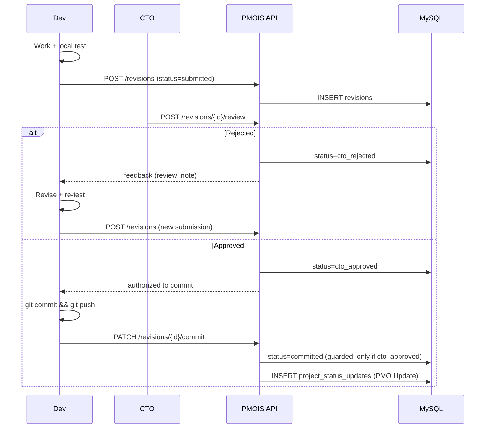

# PMOIS v2 — CTO Review → Commit → PMO Update Flow (M0 Item 10)

**Revision 1** — resolves the internal inconsistency flagged in CTO Review §3. There is exactly **one** workflow, stated below, used consistently in every diagram/state-machine in this document. Grounded in the `revisions` / `revision_reviews` tables (`02-...md` §3.6).

## 1. The Single Baseline Workflow

```
Dev Work → Dev Test → Submit CTO Review → CTO Approve → Commit/Push → PMO Update

If CTO Reject:
  → Revision → Dev Test → CTO Review (again)
```

No step order other than this appears anywhere else in this document set. In particular: **commit/push always happens after CTO approval, never before.**

---

## 2. State Machine (`revisions.status`)

```
submitted ──CTO reject──▶ (Dev revises, new submission cycle; same or new revision row)
    │
    └──CTO approve──▶ cto_approved ──Dev commit/push──▶ committed ──▶ PMO Update (project_status_updates row created)
```

| `revisions.status` | Meaning | Set by |
|---|---|---|
| `submitted` | Dev finished work + local test, submitted for CTO review | Dev, `revision.create` |
| `cto_approved` | CTO approved; Dev authorized to commit/push | CTO, `revision.review` |
| `cto_rejected` | CTO rejected; Dev must revise and resubmit | CTO, `revision.review` |
| `committed` | Dev has pushed the approved commit | Dev, `revision.create` (update own row) |

---

## 3. Step-by-Step

### Step 1–2: Dev Work → Dev Test

Dev completes the change locally and runs tests **before** submitting — `revisions.test_result` is filled in at submission time, not left `pending` by default practice (it may legitimately be `pending` only if tests are still running asynchronously, but the expectation is local test-then-submit).

### Step 3: Submit CTO Review

```
POST /api/v1/revisions   (permission: revision.create)
{
  "project_id": 892,
  "milestone_id": 15,
  "summary": "...",
  "test_result": "passed",
  "known_issue": null,
  "next_action": "...",
  "dev_user_id": 15          // or dev_ai_consumer_id, exactly one
}
→ revisions.status = 'submitted'
```

### Step 4: CTO Approve / Reject

```
POST /api/v1/revisions/{id}/review   (permission: revision.review)
{ "decision": "approved" | "rejected", "review_note": "..." }

INSERT INTO revision_reviews (revision_id, decision, review_note, reviewed_by)
UPDATE revisions SET status = 'cto_approved' | 'cto_rejected'
```

- If `rejected` → flow returns to **Step 1** (Dev Work) with the review note as feedback. A rejected revision is never committed.
- If `approved` → proceed to Step 5. **No commit has happened yet at this point.**

### Step 5: Commit/Push (only after approval)

```
PATCH /api/v1/revisions/{id}/commit   (permission: revision.create — Dev, own revision only)
{ "branch": "feature/login", "commit_hash": "a1b2c3...", "push_status": "success" }

UPDATE revisions SET status = 'committed', committed_at = NOW() WHERE id = :id AND status = 'cto_approved'
```

The `WHERE status = 'cto_approved'` guard is the enforcement point: the API rejects (`409 REVISION_NOT_APPROVED`) any attempt to record a commit on a revision that is not in `cto_approved` state — this is what makes "commit after approval, never before" an enforced rule rather than just a convention.

### Step 6: PMO Update

```
On revisions.status = 'committed':
  INSERT INTO project_status_updates (project_id, workspace_id, report_date,
      overall_status, summary, submitted_by, idempotency_key)
  -- reuses the EXISTING table (see 02-...md §2.17) — no parallel timeline invented

  Recalculate projects.progress_percent / projects.health if milestone completion changed
  (write permitted only via project.progress.update, see 05-Auth-Authorization-Design.md)
```

---

## 4. Milestone Interaction

- `revisions.milestone_id` links a revision to a milestone.
- CTO alone can close a milestone (`milestone.close`), and only after reviewing that its planned revisions are `committed` — Dev cannot close a milestone regardless of how many of their own revisions are committed (M0 Item 10 constraint, unchanged from original draft, now consistently enforced through the single workflow above).

---

## 5. Diagram



---

*Document Version: 2.0 (Revision 1)*
*Status: Revised per CTO Review — single unified workflow enforced end-to-end*
*Date: 2026-08-30*