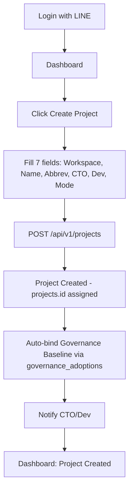
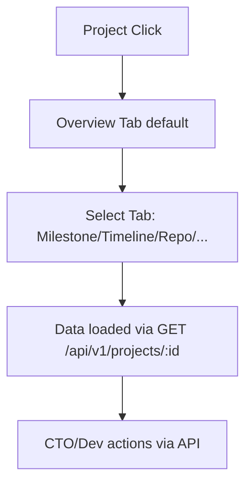
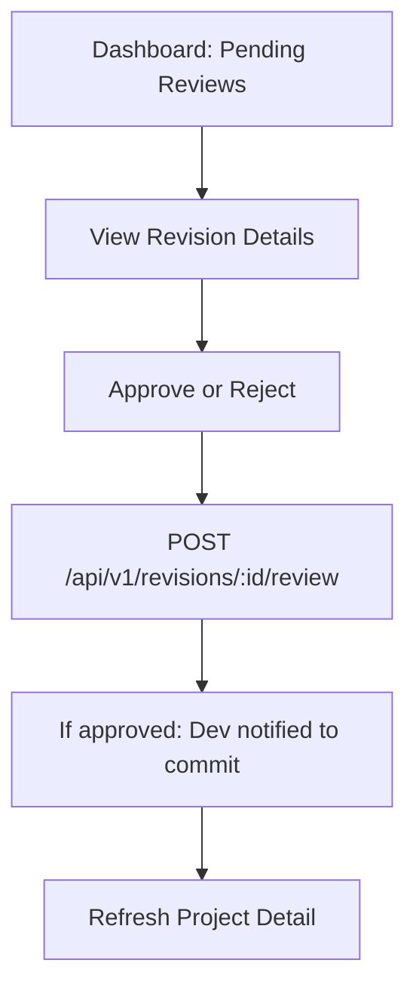

# PMOIS v2 — Web UI Sitemap / Screen List (M0 Item 14)

**Revision 2 note:** Frontend technology remains **Open Decision Q09** (`15-Risks-and-Open-Questions.md`) — nothing below should be read as React/Vite/Tailwind/Radix/TanStack/Zustand having been chosen; the table in §1.1 illustrates Option B only, in case that option is picked. WebSocket/real-time push removed (M0 uses plain polling/refetch). Governance Template Editor corrected to match `governance_versions.content` (LONGTEXT), not JSON. All API paths use `/api/v1` per `04-API-Endpoint-Design.md`. Role names CEO/CTO/Dev/Viewer map to real roles per `12-Role-Permission-Matrix.md` §1 (CEO -> is_platform_admin+PMO_REVIEWER; CTO -> CTO role; Dev -> MEMBER/SENIOR_DEV; Viewer -> VIEWER role).

## 1. Overview

### 1.1 UI Architecture — illustration of Option B only, NOT a decision

| Layer | Technology (if Option B / SPA is chosen — not decided) |
|-------|------------|
| Frontend | React 18 + TypeScript + Vite |
| Routing | React Router v6 |
| State Management | TanStack Query + Zustand |
| UI Library | Radix UI + Tailwind CSS |
| Charts | Chart.js + Recharts |
| Forms | React Hook Form + Zod |

If Option A (server-rendered PHP views) is chosen instead, the screen/route list in §3 still applies as URL paths; the libraries above simply would not be used.

---

## 2. Web UI Sitemap (screen groups)

- **Header / Top Bar**: Portfolio Overview (Dashboard), Projects (Registry), My Projects, Workspaces, Notifications, User Menu (LINE name -> Logout)
- **Portfolio Dashboard**: Overview chart, Milestones list, Activity feed, Projects summary, Governance templates, Tokens management
- **Project Registry**: Project list (table, pagination, filters) — Internal ID, Code, Name, Status, Mode, CTO, Dev; actions: View, Edit, Move, Archive
- **Project Detail** (13 tabs — see §3.3): Overview, Milestone, Timeline, Repository, CTO Review, Commit, Test, Deployment, AI Team, Risk, Known Issue, Decision, Governance
- **Project Structure Management**: Workspace selector, Parent project tree, Move/Promote/Reparent actions, Structure History
- **Milestone / Review Console**: Milestone list with progress, Revision queue per milestone, CTO Approve/Reject, Review queue with comments
- **Governance Template Management**: Template list (type, version, last updated, bind/unbind), Template editor (content is rich text / LONGTEXT matching `governance_versions.content` — not JSON), preview
- **Repository Management**: Repository list per project (name, type, branches, status), manual metadata edit, link to GitLab (opens in new tab) — no auto-sync/auto-create in M0, see `10-GitLab-Repository-Design.md`
- **AI / Team Assignment**: Current assignments (AI agents per role, human team members, assignment history), Add/Remove AI agent (select from `ai_consumers` registry, assign to CTO or Dev role)
- **API / Token Management**: Project tokens (list, create, rotate, revoke; scopes shown for reference only — not the authorization decision, see `05-Auth-Authorization-Design.md`), last used, expiration
- **Timeline / Activity History**: Activity feed (recent actions: push, review, milestone; filters by project/date/actor), Project timeline (milestones, revisions, commits)

---

## 3. Screen List

### 3.1 Authentication & Onboarding

| Screen | Path | Access | Description |
|--------|------|--------|-------------|
| Login | `/auth/line` | Guest | "Login with LINE" button |
| Callback | `/auth/line/callback` | Guest | LINE OIDC callback + token exchange |
| Unauthorized | `/auth/error` | Guest | Fail-closed message when LINE user has no active `workspace_members` row |

### 3.2 Dashboard Screens

| Screen | Path | Access | Description |
|--------|------|--------|-------------|
| Portfolio Dashboard | `/` or `/dashboard` | All roles | Overview of all accessible projects, portfolio status |
| Project List | `/projects` | All roles | List with filters (workspace, status, mode) |
| My Projects | `/projects/my` | All roles | Projects where the user has a `project_members`/`project_ai_assignments` row |

### 3.3 Project Detail Screens (13 tabs)

| Tab | Path | Key Data |
|-----|------|----------|
| Overview | `/projects/:id` | Basics, status, mode, governance adoption, progress |
| Milestone | `/projects/:id/milestones` | Milestone list, progress, CTO close/open actions |
| Timeline | `/projects/:id/timeline` | Activity feed |
| Repository | `/projects/:id/repositories` | Repo list, GitLab link (manual metadata, see `10-...md`) |
| CTO Review | `/projects/:id/review` | Pending revisions (`revisions.status='submitted'`), approval queue |
| Commit | `/projects/:id/commits` | Commit hash/branch/push_status from `revisions` |
| Test | `/projects/:id/test` | `revisions.test_result`, known issues |
| Deployment | `/projects/:id/deployment` | Deployment info recorded via `project_status_updates` |
| AI Team | `/projects/:id/ai` | `project_ai_assignments`, context via `ai_context_exports` |
| Risk | `/projects/:id/risk` | Known issues (out of core schema v1 — see `02-...md` §6) |
| Known Issue | `/projects/:id/issues` | `revisions.known_issue` field |
| Decision | `/projects/:id/decisions` | `decision_registers` filtered by `project_id` |
| Governance | `/projects/:id/governance` | `governance_adoptions` + `governance_adoption_items` |

### 3.4 Structure Management

| Screen | Path | Description |
|--------|------|-------------|
| Project Structure | `/projects/:id/structure` | Move workspace / change parent / promote; shows `project_structure_history` |
| Workspace List | `/workspaces` | List workspaces, members |

### 3.5 Governance Screens

| Screen | Path | Description |
|--------|------|-------------|
| Governance Dashboard | `/governance-records` | List `governance_records` + versions |
| Version Detail | `/governance-versions/:id` | Edit `content` (LONGTEXT), items, publish |
| Project Binding | `/projects/:id/governance` | `governance_adoptions` bind/view |

### 3.6 Team / AI Assignment

| Screen | Path | Description |
|--------|------|-------------|
| Team Assignment | `/projects/:id/team` | `project_members` (human) management |
| AI Assignment | `/projects/:id/ai-assignments` | `project_ai_assignments` management |
| AI Registry | `/ai-consumers` | Existing `ai_consumers` list (already implemented) |

### 3.7 Token Management

| Screen | Path | Description |
|--------|------|-------------|
| Token List | `/api-tokens` | Existing `api_tokens`; scopes shown for reference only |
| Token Create | `/api-tokens/create` | Generate token, bind to project (optional) |

### 3.8 Admin / Settings

| Screen | Path | Access | Description |
|--------|------|--------|-------------|
| User Settings | `/settings/profile` | All | Profile, LINE connection status |
| Audit Log | `/audit` | CTO / is_platform_admin | `audit_trails` view |

---

## 4. UI/UX Principles (M0)

| Principle | Description |
|-----------|-------------|
| Minimal CEO Input | Create project with 7 fields max; technical details added later |
| Progressive Disclosure | Basics first; advanced settings on demand |
| Single Source of Truth | UI and API share the same data (existing `ApiResponse` envelope) |
| Fail-Closed | Unauthorized LINE users cannot access any page |
| Responsive | Works on mobile/tablet/desktop |
| Accessibility | WCAG 2.1 AA target (library choice depends on Q09) |
| Real-time Updates | Plain polling/refetch — WebSocket/push is not a confirmed requirement |

---

## 5. Flow Diagrams (mermaid — API paths corrected to `/api/v1`)

### 5.1 Project Creation Flow

### 5.2 Project Detail Navigation

### 5.3 CTO Review Flow (UI)

---

## 6. Responsive Breakpoints

| Device | Width | Notes |
|--------|-------|-------|
| Mobile | < 640px | Sidebar collapses; cards stack vertically |
| Tablet | 640-1024px | Partial sidebar; 2-column stats |
| Desktop | > 1024px | Full sidebar; complex tables enabled |

---

## 7. Access Control per Screen (mapped to real roles — see `12-Role-Permission-Matrix.md`)

| Screen | CEO (is_platform_admin/PMO_REVIEWER) | CTO | Dev (MEMBER/SENIOR_DEV) | Viewer |
|--------|-----|-----|-----|--------|
| Dashboard | Yes | Yes | Yes | Yes |
| Project List/Detail | Yes | Yes | Yes (own) | Yes (read-only) |
| Structure Management | Yes | Yes | No | No |
| Governance Templates | Yes | Yes | No (read-only) | No (read-only) |
| AI Assignment | Yes | Yes | No | No |
| Token Management | Yes | Yes | Yes (own) | No |
| Audit Log | Yes | Yes | No | No |

---

## 8. Summary

| Aspect | Status |
|--------|-------------------|
| Frontend Framework | Not decided — Open Decision Q09 |
| Sitemap | Decided — screens organized by function |
| Project Detail | Decided — 13 tabs covering all required sections |
| Access Control | Decided — role-based via existing `PermissionResolver` |
| UI Library / State Management | Not decided — depends on Q09 outcome |

---

*Document Version: 2.0 (Revision 2)*
*Status: Revised per CTO Review*
*Date: 2026-08-30*