# PMOIS v2 — ER Diagram & Database Design — Revision 6

**Supersedes:** `M0-Design/02-MySQL-ER-Diagram-Database-Table-Design.md` §1 (diagram) and §3 (new tables) — R5 sections 2 (existing tables) remain verbatim valid.
**Baseline:** migrations `0001`–`0042` already applied (M1 Phase 1). All R6 changes are **additive**, numbered from `0043`.

Conventions unchanged: `BIGINT UNSIGNED AUTO_INCREMENT PK`, `workspace_id` on every workspace-scoped table, `created_at/updated_at TIMESTAMP`, InnoDB utf8mb4, raw PDO via `BaseRepository`.

---

## 1. Updated Full ER Diagram (Mermaid) — Revision 6

```mermaid
erDiagram
    USERS ||--o{ WORKSPACE_MEMBERS : "has membership"
    USERS ||--o{ PROJECT_MEMBERS : "current authorization"
    USERS ||--o{ PROJECT_MEMBER_ASSIGNMENTS : "[R6] assignment history"
    USERS ||--o{ WORKSPACES : "created_by"
    USERS ||--o{ API_TOKENS : "created_by_user_id"

    WORKSPACES ||--o{ PROJECTS : contains
    WORKSPACES ||--o| WORKSPACE_DEFAULT_SETTINGS : "[R6] 1:1 defaults"
    WORKSPACES ||--o{ PROJECT_TEMPLATES : "[R6] defines"
    WORKSPACES ||--o{ AI_CONSUMERS : registers
    WORKSPACES ||--o{ API_TOKENS : scopes
    WORKSPACES ||--o{ GOVERNANCE_RECORDS : owns
    WORKSPACES ||--o{ WORKSPACE_MODULE_SETTINGS : configures
    WORKSPACES ||--o{ AUDIT_TRAILS : scopes

    AI_PROVIDERS ||--o{ AI_CONSUMERS : "[R6] provider of"
    PROJECT_TEMPLATES }o--o| GOVERNANCE_VERSIONS : "[R6] default governance"
    PROJECTS }o--o| PROJECT_TEMPLATES : "[R6] created_from_template"

    ROLES ||--o{ WORKSPACE_MEMBERS : "grants role"
    ROLES ||--o{ PROJECT_MEMBERS : "grants role"
    ROLES ||--o{ PROJECT_MEMBER_ASSIGNMENTS : "[R6] grants role"
    ROLES ||--o{ PROJECT_AI_ASSIGNMENTS : "grants role"
    ROLES ||--o{ ROLE_PERMISSIONS : defines

    PROJECTS ||--o{ PROJECT_MEMBERS : has
    PROJECTS ||--o{ PROJECT_MEMBER_ASSIGNMENTS : "[R6] history"
    PROJECTS ||--o{ PROJECT_STATUS_UPDATES : reports
    PROJECTS ||--o{ GOVERNANCE_ADOPTIONS : adopts
    PROJECTS ||--o{ PROJECT_STRUCTURE_HISTORY : logs
    PROJECTS ||--o{ REPOSITORIES : registers
    PROJECTS ||--o{ MILESTONES : tracks
    PROJECTS ||--o{ PROJECT_AI_ASSIGNMENTS : assigns
    PROJECTS ||--o{ REVISIONS : submits
    PROJECTS ||--o{ PROJECT_TECHNOLOGY_STACK : "[R6] declares"
    PROJECTS ||--o{ PROJECT_ENVIRONMENTS : "[R6] deploys to"
    PROJECTS ||--o{ PROJECT_DEPENDENCIES : "[R6] depends"
    PROJECTS ||--o{ PROJECT_RELEASES : "[R6] releases"
    PROJECTS }o--|| PROJECTS : "parent_project_id (self-ref)"
    PROJECTS }o--|| PROJECTS : "[R6] project_dependencies (self-ref graph)"
    PROJECTS ||--o{ API_TOKENS : "scopes (project-level)"

    MILESTONES ||--o{ REVISIONS : groups
    MILESTONES ||--o{ PROJECT_RELEASES : "[R6] may close"
    REVISIONS ||--o| REVISION_REVIEWS : "reviewed by CTO"
    REVISIONS }o--o| PROJECT_STATUS_UPDATES : "triggers"

    GIT_PROVIDERS ||--o{ REPOSITORIES : "[R6] hosts"
    REPOSITORIES }o--o{ PROJECT_ENVIRONMENTS : "[R6] deploys from"
    REPOSITORIES ||--o{ PROJECT_RELEASES : "[R6] released from"
    PROJECT_ENVIRONMENTS ||--o{ PROJECT_RELEASES : "[R6] released to"

    AI_CONSUMERS ||--o{ API_TOKENS : "ai_consumer_id"
    AI_CONSUMERS ||--o{ AI_CONTEXT_EXPORTS : exports
    AI_CONSUMERS ||--o{ PROJECT_AI_ASSIGNMENTS : "assigned to"

    GOVERNANCE_RECORDS ||--o{ GOVERNANCE_VERSIONS : versions
    GOVERNANCE_VERSIONS ||--o{ GOVERNANCE_VERSION_ITEMS : contains
    GOVERNANCE_VERSIONS ||--o{ GOVERNANCE_ADOPTIONS : "adopted as"
    GOVERNANCE_ADOPTIONS ||--o{ GOVERNANCE_ADOPTION_ITEMS : "tracks compliance"

    RFCS ||--o{ RFC_COMMENTS : has
    RFCS }o--o| DECISION_REGISTERS : "may convert to"
    DECISION_REGISTERS }o--o| GOVERNANCE_RECORDS : "may relate"

    API_TOKENS ||--o{ AI_CONTEXT_EXPORTS : "used to export"
```



---

## 2. New Tables (`[R6-NEW]`)

### 2.1 `ai_providers` — AI Provider Registry (global, not workspace-scoped)

Providers are platform-level facts (OpenAI, Anthropic, Google, Microsoft, Human), not per-workspace data. Global table, seeded once, managed by platform admin only.

```sql
CREATE TABLE ai_providers (
    id BIGINT UNSIGNED AUTO_INCREMENT PRIMARY KEY,
    code VARCHAR(50) NOT NULL,
    name VARCHAR(150) NOT NULL,
    status ENUM('active','inactive') NOT NULL DEFAULT 'active',
    created_by BIGINT UNSIGNED NOT NULL,
    created_at TIMESTAMP NOT NULL DEFAULT CURRENT_TIMESTAMP,
    updated_at TIMESTAMP NOT NULL DEFAULT CURRENT_TIMESTAMP ON UPDATE CURRENT_TIMESTAMP,
    UNIQUE KEY uq_ai_providers_code (code),
    CONSTRAINT fk_aip_created_by FOREIGN KEY (created_by) REFERENCES users(id)
) ENGINE=InnoDB DEFAULT CHARSET=utf8mb4;

-- Seed (same migration):
INSERT INTO ai_providers (code, name, created_by)
SELECT 'openai','OpenAI', u.id FROM users u WHERE u.is_platform_admin = 1 LIMIT 1
UNION ALL SELECT 'anthropic','Anthropic', u.id FROM users u WHERE u.is_platform_admin = 1 LIMIT 1
UNION ALL SELECT 'google','Google', u.id FROM users u WHERE u.is_platform_admin = 1 LIMIT 1
UNION ALL SELECT 'microsoft','Microsoft', u.id FROM users u WHERE u.is_platform_admin = 1 LIMIT 1
UNION ALL SELECT 'human','Human', u.id FROM users u WHERE u.is_platform_admin = 1 LIMIT 1;
```

### 2.2 `ai_consumers` — `[R6-ALTER]` Provider ⟂ Agent split

Agent (ChatGPT, Codex, Claude, Claude Code, Gemini, Human) references its Provider. **Project assignment continues to reference the Agent (`ai_consumers.id`) — never a hardcoded name** (CTO Requirement #2).

```sql
ALTER TABLE ai_consumers
    ADD COLUMN provider_id BIGINT UNSIGNED NULL AFTER workspace_id,
    ADD CONSTRAINT fk_aic_provider FOREIGN KEY (provider_id) REFERENCES ai_providers(id);

-- Backfill: point every existing consumer at the Human provider until reclassified
UPDATE ai_consumers ac
JOIN ai_providers p ON p.code = 'human'
SET ac.provider_id = p.id
WHERE ac.provider_id IS NULL;
```

- `provider_id` is nullable at the column level only for migration safety; the **service layer requires it on every create/update** (`VALIDATION_ERROR` otherwise).
- Example registry content: Provider `openai` → Agents `chatgpt`, `codex`; Provider `anthropic` → Agents `claude`, `claude-code`; Provider `google` → `gemini`; Provider `human` → `human`.

### 2.3 `project_member_assignments` — Project Team Registry with History (CTO Requirement #1)

`project_members` (existing, `uq_project_user`) remains the **live authorization projection** read by `PermissionResolver` — unchanged. This new table is the **assignment ledger** (multiple assignees per project + full history) for both humans and, conceptually, mirrors the pattern of `project_ai_assignments`.

```sql
CREATE TABLE project_member_assignments (
    id BIGINT UNSIGNED AUTO_INCREMENT PRIMARY KEY,
    project_id BIGINT UNSIGNED NOT NULL,
    workspace_id BIGINT UNSIGNED NOT NULL,
    user_id BIGINT UNSIGNED NOT NULL,
    role_id BIGINT UNSIGNED NOT NULL,
    assignment_source ENUM('direct','workspace_default','project_template') NOT NULL DEFAULT 'direct',
    note VARCHAR(300) NULL,
    assigned_by BIGINT UNSIGNED NOT NULL,
    assigned_at TIMESTAMP NOT NULL DEFAULT CURRENT_TIMESTAMP,
    revoked_by BIGINT UNSIGNED NULL,
    revoked_at TIMESTAMP NULL,
    KEY KEY_pma_project (project_id),
    KEY KEY_pma_user (user_id),
    CONSTRAINT fk_pma_project FOREIGN KEY (project_id) REFERENCES projects(id),
    CONSTRAINT fk_pma_workspace FOREIGN KEY (workspace_id) REFERENCES workspaces(id),
    CONSTRAINT fk_pma_user FOREIGN KEY (user_id) REFERENCES users(id),
    CONSTRAINT fk_pma_role FOREIGN KEY (role_id) REFERENCES roles(id),
    CONSTRAINT fk_pma_assigned_by FOREIGN KEY (assigned_by) REFERENCES users(id),
    CONSTRAINT fk_pma_revoked_by FOREIGN KEY (revoked_by) REFERENCES users(id)
) ENGINE=InnoDB DEFAULT CHARSET=utf8mb4;
```

**Consistency rule (service layer):** an active row (`revoked_at IS NULL`) MUST have a matching `project_members` row; revoking the assignment removes/updates the `project_members` projection. History = all rows, never deleted.

**Team Role coverage (CEO/PMO/CTO/Dev/Viewer):** no new `roles` rows are invented — mapping per `12-Role-Permission-Matrix.md` §1 stays: CEO → `is_platform_admin` + `PMO_REVIEWER`; PMO → `PMO_REVIEWER`; CTO → `CTO`; Dev → `MEMBER`/`SENIOR_DEV`; Viewer → `VIEWER`. Multiple assignees per role = multiple rows.

### 2.4 `git_providers` — Git Provider Registry (CTO Requirement #4)

```sql
CREATE TABLE git_providers (
    id BIGINT UNSIGNED AUTO_INCREMENT PRIMARY KEY,
    code VARCHAR(50) NOT NULL,
    name VARCHAR(150) NOT NULL,
    base_url VARCHAR(500) NULL,
    status ENUM('active','inactive') NOT NULL DEFAULT 'active',
    created_by BIGINT UNSIGNED NOT NULL,
    created_at TIMESTAMP NOT NULL DEFAULT CURRENT_TIMESTAMP,
    updated_at TIMESTAMP NOT NULL DEFAULT CURRENT_TIMESTAMP ON UPDATE CURRENT_TIMESTAMP,
    UNIQUE KEY uq_git_providers_code (code),
    CONSTRAINT fk_gp_created_by FOREIGN KEY (created_by) REFERENCES users(id)
) ENGINE=InnoDB DEFAULT CHARSET=utf8mb4;

-- Seed:
INSERT INTO git_providers (code, name, base_url, created_by)
SELECT 'gitlab','GitLab','https://gitlab.com', u.id FROM users u WHERE u.is_platform_admin = 1 LIMIT 1;
```

### 2.5 `repositories` — `[R6-ALTER]` provider-agnostic

```sql
ALTER TABLE repositories
    ADD COLUMN git_provider_id BIGINT UNSIGNED NULL AFTER workspace_id,
    ADD CONSTRAINT fk_repo_git_provider FOREIGN KEY (git_provider_id) REFERENCES git_providers(id);

ALTER TABLE repositories
    CHANGE COLUMN gitlab_url repository_url VARCHAR(500) NOT NULL;
-- Unique key uq_repo_url follows the renamed column automatically (index on gitlab_url renamed with table rebuild).
```

Branch columns (`default_branch`, `development_branch`, `release_branch`, `production_branch`) and `repository_status` already exist from migration `0037` — requirement #4 fully covered. Self-hosted GitLab: `git_providers.base_url` + absolute `repository_url`.

### 2.6 `project_technology_stack` — Tech Stack Registry (CTO Requirement #6)

**Not required at project creation.** CEO form has no tech-stack field; CTO/Dev add entries progressively (permission-gated).

```sql
CREATE TABLE project_technology_stack (
    id BIGINT UNSIGNED AUTO_INCREMENT PRIMARY KEY,
    project_id BIGINT UNSIGNED NOT NULL,
    workspace_id BIGINT UNSIGNED NOT NULL,
    layer ENUM('language','framework','database','runtime','frontend','infrastructure','tooling','other') NOT NULL,
    name VARCHAR(150) NOT NULL,
    version VARCHAR(50) NULL,
    notes TEXT NULL,
    status ENUM('active','deprecated','planned') NOT NULL DEFAULT 'active',
    added_by BIGINT UNSIGNED NOT NULL,
    created_at TIMESTAMP NOT NULL DEFAULT CURRENT_TIMESTAMP,
    updated_at TIMESTAMP NOT NULL DEFAULT CURRENT_TIMESTAMP ON UPDATE CURRENT_TIMESTAMP,
    UNIQUE KEY uq_pts_project_layer_name (project_id, layer, name),
    CONSTRAINT fk_pts_project FOREIGN KEY (project_id) REFERENCES projects(id),
    CONSTRAINT fk_pts_workspace FOREIGN KEY (workspace_id) REFERENCES workspaces(id),
    CONSTRAINT fk_pts_added_by FOREIGN KEY (added_by) REFERENCES users(id)
) ENGINE=InnoDB DEFAULT CHARSET=utf8mb4;
```

### 2.7 `project_environments` — Environment Registry (CTO Requirement #7)

No secrets/passwords ever — same `credential_reference` pointer pattern as `repositories`.

```sql
CREATE TABLE project_environments (
    id BIGINT UNSIGNED AUTO_INCREMENT PRIMARY KEY,
    project_id BIGINT UNSIGNED NOT NULL,
    workspace_id BIGINT UNSIGNED NOT NULL,
    environment ENUM('development','uat','production') NOT NULL,
    name VARCHAR(150) NOT NULL,
    url VARCHAR(500) NULL,
    runtime VARCHAR(150) NULL,
    php_version VARCHAR(20) NULL,
    database_engine VARCHAR(100) NULL,
    deploy_path VARCHAR(500) NULL,
    credential_reference VARCHAR(200) NULL,   -- pointer to secret store; NEVER the secret itself
    status ENUM('active','inactive') NOT NULL DEFAULT 'active',
    created_by BIGINT UNSIGNED NOT NULL,
    created_at TIMESTAMP NOT NULL DEFAULT CURRENT_TIMESTAMP,
    updated_at TIMESTAMP NOT NULL DEFAULT CURRENT_TIMESTAMP ON UPDATE CURRENT_TIMESTAMP,
    UNIQUE KEY uq_pe_project_env_name (project_id, environment, name),
    CONSTRAINT fk_pe_project FOREIGN KEY (project_id) REFERENCES projects(id),
    CONSTRAINT fk_pe_workspace FOREIGN KEY (workspace_id) REFERENCES workspaces(id),
    CONSTRAINT fk_pe_created_by FOREIGN KEY (created_by) REFERENCES users(id)
) ENGINE=InnoDB DEFAULT CHARSET=utf8mb4;
```

### 2.8 `project_dependencies` — Dependency Registry (CTO Requirement #8)

Both directions stored explicitly for simple graph queries (`Depends On` and `Blocked By` are the same edge read from either end; storing both typed edges keeps the Portfolio Dashboard query trivial and matches the CTO's naming).

```sql
CREATE TABLE project_dependencies (
    id BIGINT UNSIGNED AUTO_INCREMENT PRIMARY KEY,
    workspace_id BIGINT UNSIGNED NOT NULL,
    project_id BIGINT UNSIGNED NOT NULL,
    related_project_id BIGINT UNSIGNED NOT NULL,
    dependency_type ENUM('depends_on','blocked_by') NOT NULL,
    note VARCHAR(300) NULL,
    created_by BIGINT UNSIGNED NOT NULL,
    created_at TIMESTAMP NOT NULL DEFAULT CURRENT_TIMESTAMP,
    updated_at TIMESTAMP NOT NULL DEFAULT CURRENT_TIMESTAMP ON UPDATE CURRENT_TIMESTAMP,
    UNIQUE KEY uq_pd_edge (project_id, related_project_id, dependency_type),
    CONSTRAINT fk_pd_project FOREIGN KEY (project_id) REFERENCES projects(id),
    CONSTRAINT fk_pd_related FOREIGN KEY (related_project_id) REFERENCES projects(id),
    CONSTRAINT fk_pd_workspace FOREIGN KEY (workspace_id) REFERENCES workspaces(id),
    CONSTRAINT fk_pd_created_by FOREIGN KEY (created_by) REFERENCES users(id)
) ENGINE=InnoDB DEFAULT CHARSET=utf8mb4;
```

Service-layer rules: no self-reference; no circular `depends_on` chain (ancestor walk, same algorithm as `CIRCULAR_HIERARCHY`); both projects must share the same `workspace_id`; inverse edge auto-suggested (`blocked_by` is the mirror of `depends_on` — UI offers to create the mirror row).

### 2.9 `project_releases` — Release Registry (CTO Requirement #9)

Deliberately **separate** from Timeline (`project_status_updates` = PMO reporting) and from `revisions` (Dev↔CTO review cycles). Release history is its own registry.

```sql
CREATE TABLE project_releases (
    id BIGINT UNSIGNED AUTO_INCREMENT PRIMARY KEY,
    project_id BIGINT UNSIGNED NOT NULL,
    workspace_id BIGINT UNSIGNED NOT NULL,
    release_type ENUM('alpha','beta','rc','production','hotfix') NOT NULL,
    version_label VARCHAR(50) NOT NULL,
    status ENUM('planned','in_progress','released','rolled_back','cancelled') NOT NULL DEFAULT 'planned',
    repository_id BIGINT UNSIGNED NULL,
    environment_id BIGINT UNSIGNED NULL,
    milestone_id BIGINT UNSIGNED NULL,
    release_notes TEXT NULL,
    released_by BIGINT UNSIGNED NULL,
    released_at TIMESTAMP NULL,
    created_by BIGINT UNSIGNED NOT NULL,
    created_at TIMESTAMP NOT NULL DEFAULT CURRENT_TIMESTAMP,
    updated_at TIMESTAMP NOT NULL DEFAULT CURRENT_TIMESTAMP ON UPDATE CURRENT_TIMESTAMP,
    UNIQUE KEY uq_pr_project_version (project_id, version_label),
    KEY KEY_pr_project_type (project_id, release_type),
    CONSTRAINT fk_pr_project FOREIGN KEY (project_id) REFERENCES projects(id),
    CONSTRAINT fk_pr_workspace FOREIGN KEY (workspace_id) REFERENCES workspaces(id),
    CONSTRAINT fk_pr_repository FOREIGN KEY (repository_id) REFERENCES repositories(id),
    CONSTRAINT fk_pr_environment FOREIGN KEY (environment_id) REFERENCES project_environments(id),
    CONSTRAINT fk_pr_milestone FOREIGN KEY (milestone_id) REFERENCES milestones(id),
    CONSTRAINT fk_pr_released_by FOREIGN KEY (released_by) REFERENCES users(id),
    CONSTRAINT fk_pr_created_by FOREIGN KEY (created_by) REFERENCES users(id)
) ENGINE=InnoDB DEFAULT CHARSET=utf8mb4;
```

### 2.10 `project_templates` — Project Template (CTO Requirement #10)

```sql
CREATE TABLE project_templates (
    id BIGINT UNSIGNED AUTO_INCREMENT PRIMARY KEY,
    workspace_id BIGINT UNSIGNED NOT NULL,
    code VARCHAR(50) NOT NULL,
    name VARCHAR(150) NOT NULL,
    description TEXT NULL,
    is_default BOOLEAN NOT NULL DEFAULT FALSE,
    payload JSON NOT NULL,   -- see R6-05 §3 for the payload contract
    status ENUM('active','inactive') NOT NULL DEFAULT 'active',
    created_by BIGINT UNSIGNED NOT NULL,
    created_at TIMESTAMP NOT NULL DEFAULT CURRENT_TIMESTAMP,
    updated_at TIMESTAMP NOT NULL DEFAULT CURRENT_TIMESTAMP ON UPDATE CURRENT_TIMESTAMP,
    UNIQUE KEY uq_pt_workspace_code (workspace_id, code),
    CONSTRAINT fk_pt_workspace FOREIGN KEY (workspace_id) REFERENCES workspaces(id),
    CONSTRAINT fk_pt_created_by FOREIGN KEY (created_by) REFERENCES users(id)
) ENGINE=InnoDB DEFAULT CHARSET=utf8mb4;
```

### 2.11 `workspace_default_settings` — Workspace Defaults (CTO Requirement #11)

Typed columns (not key-value) to keep FK integrity on defaults.

```sql
CREATE TABLE workspace_default_settings (
    id BIGINT UNSIGNED AUTO_INCREMENT PRIMARY KEY,
    workspace_id BIGINT UNSIGNED NOT NULL,
    default_cto_user_id BIGINT UNSIGNED NULL,
    default_dev_user_id BIGINT UNSIGNED NULL,
    default_governance_version_id BIGINT UNSIGNED NULL,
    default_git_provider_id BIGINT UNSIGNED NULL,
    default_project_template_id BIGINT UNSIGNED NULL,
    default_development_mode ENUM('manual','ai_assisted','ai_dev_auto') NOT NULL DEFAULT 'manual',
    default_permission_preset VARCHAR(50) NULL,  -- e.g. 'standard','restricted' — resolved by service layer
    created_by BIGINT UNSIGNED NOT NULL,
    created_at TIMESTAMP NOT NULL DEFAULT CURRENT_TIMESTAMP,
    updated_at TIMESTAMP NOT NULL DEFAULT CURRENT_TIMESTAMP ON UPDATE CURRENT_TIMESTAMP,
    UNIQUE KEY uq_wds_workspace (workspace_id),
    CONSTRAINT fk_wds_workspace FOREIGN KEY (workspace_id) REFERENCES workspaces(id),
    CONSTRAINT fk_wds_cto FOREIGN KEY (default_cto_user_id) REFERENCES users(id),
    CONSTRAINT fk_wds_dev FOREIGN KEY (default_dev_user_id) REFERENCES users(id),
    CONSTRAINT fk_wds_govver FOREIGN KEY (default_governance_version_id) REFERENCES governance_versions(id),
    CONSTRAINT fk_wds_gitprov FOREIGN KEY (default_git_provider_id) REFERENCES git_providers(id),
    CONSTRAINT fk_wds_template FOREIGN KEY (default_project_template_id) REFERENCES project_templates(id),
    CONSTRAINT fk_wds_created_by FOREIGN KEY (created_by) REFERENCES users(id)
) ENGINE=InnoDB DEFAULT CHARSET=utf8mb4;
```

"Default Permission" preset codes (`standard`, `restricted`, …) are resolved by the service layer into role choices for new members; the presets themselves are code-level configuration (like permission seeds), not a new table — flagged as a seed/config item in R6-02.

### 2.12 `projects` — `[R6-ALTER]` template provenance

```sql
ALTER TABLE projects
    ADD COLUMN source_template_id BIGINT UNSIGNED NULL AFTER parent_project_id,
    ADD CONSTRAINT fk_projects_source_template FOREIGN KEY (source_template_id) REFERENCES project_templates(id);
```

---

## 3. Existing R5/R6-satisfied items — no schema change

| Requirement | Already covered by |
|---|---|
| #3 Development Mode (`manual`/`ai_assisted`/`ai_dev_auto`) | `projects.development_mode` (migration 0034); used for Dashboard filtering and future analysis |
| #5 Progress vs Profile Completeness | `projects.progress_percent` (work tracking, CTO/PMO-writable) **vs** `projects.profile_completeness_percent` (data completeness, computed) |

## 4. Profile Completeness Formula (CTO Requirement #5 — formal definition)

`profile_completeness_percent` is **computed, never manually set** (difference from `progress_percent`, which is manually set by CTO/PMO):

| Checklist item | Weight | Satisfied when |
|---|---|---|
| Governance binding | 15 | ≥1 active `governance_adoptions` row |
| Team (CTO + Dev assigned) | 15 | ≥1 active human CTO and ≥1 active Dev in `project_member_assignments` (or AI assignment for Dev in `ai_dev_auto` mode) |
| ≥1 Repository registered | 15 | `repositories` non-empty |
| ≥1 Milestone defined | 10 | `milestones` non-empty |
| ≥1 Environment registered | 15 | `project_environments` non-empty |
| Technology Stack ≥3 entries | 15 | `project_technology_stack` count ≥ 3 |
| ≥1 Release recorded | 10 | `project_releases` non-empty |
| Description + start date present | 5 | `projects.description IS NOT NULL AND start_date IS NOT NULL` |
| **Total** | **100** | |

Recomputed on read (or cached and refreshed on relevant writes); recomputation triggers: any write to the contributing tables. Default 0 on a fresh project — a new project is legitimately incomplete.

---

*Document Version: 6.0 — For CTO Review (Design Freeze candidate)*
*Date: 2026-09-05*
